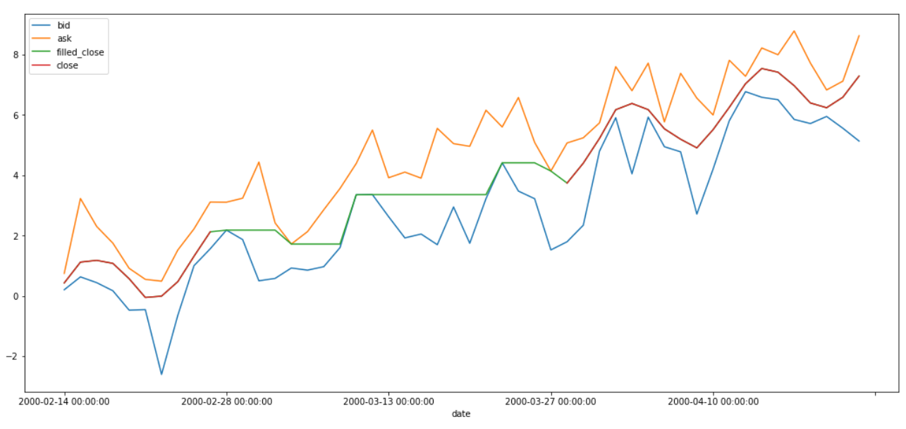
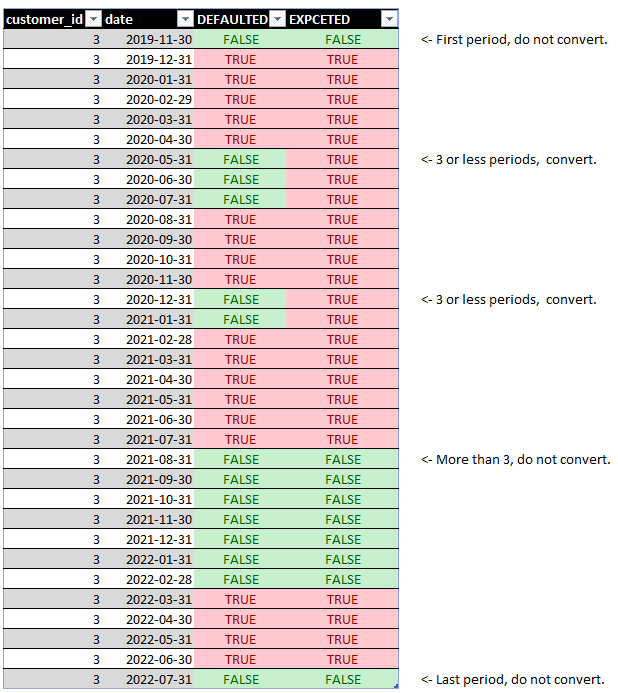

# SQL-real-world-problems

## Introduction

Before you get your first job with heavy SQL usage it is often difficult to understand what kind of queries you might en up writing. Is all I need joins and group by to be fluent in SQL?

This respository contains a small dataset and 5 questions I have encountered as an analyst in the finacial sector. I have tried ordering them making them progressivly harder. I also try to select problems that use a single or max 2 tables to keep it simple.

If you are unfamliar with window functions and recursion you will struggle with all but the first question. Go read up on those concepts first.

To query the database, you can use Python + Jupyter Notebook + sqlite. Alternativly you can download some software build for querying SQLite databases, for example this: https://sqlitebrowser.org/.

The database is in this repository, and is called `data.db`.

*Answers will be posted soon.*

Enjoy!


## 1. Stale/Flat bond prices

Bond prices should not be flat for too long. We need to find bonds that have not had updated prices!

### Task:

Write a query that return all bonds that have been flat for at least the last
5 observed values, the query should also return how many periods the price has been flat.

### Tables Needed:

Only the `bond_prices` table is needed for this task.

```sql
select * from bond_prices order by date desc limit 15;
```

|   index | date                |   price |   bond_id |
|--------:|:--------------------|--------:|----------:|
|      59 | 2001-03-23 00:00:00 | 100.683 |         0 |
|     119 | 2001-03-23 00:00:00 | 100.373 |         1 |
|     179 | 2001-03-23 00:00:00 | 100.47  |         2 |
|     239 | 2001-03-23 00:00:00 | 100.456 |         3 |
|     299 | 2001-03-23 00:00:00 | 100.928 |         4 |
|     359 | 2001-03-23 00:00:00 | 100.651 |         5 |
|     419 | 2001-03-23 00:00:00 | 100.376 |         6 |
|     479 | 2001-03-23 00:00:00 | 100.791 |         7 |
|     539 | 2001-03-23 00:00:00 | 100.958 |         8 |
|     599 | 2001-03-23 00:00:00 | 100.392 |         9 |
|      58 | 2001-03-22 00:00:00 | 100.507 |         0 |
|     118 | 2001-03-22 00:00:00 | 100.72  |         1 |
|     178 | 2001-03-22 00:00:00 | 100.47  |         2 |
|     238 | 2001-03-22 00:00:00 | 100.678 |         3 |
|     298 | 2001-03-22 00:00:00 | 100.928 |         4 |

### Difficluty:

Easy. If you claim to know SQL, this one you should be able to solve.

## 2. Convert and fill FX values for fund prices.

We need to report foreign fund prices in USD each business day. But some days we are missing fund prices if the foregin fund has a holiday, and sometimes we are missing FX rates for various reasones.

### Task:

Write a query that extract all fund data in USD, but also returns data for all missing business days (Monday to Friday). For missing dates the values should be forward filled (last valid observations should be used). Note that if FX has a new value but not the fund, we still expect the reported value to move due to FX fluctuations between the days.

### Difficulty:

Easy/Medium. A few more steps, maybe a trip to StackOverflow?

### Tables needed:

`fund_prices` and `fx_rates`

```sql
select * from fund_prices order by fund_id, date desc limit 5
```

|   index | date                |   fund_id |     nav | currency   |
|--------:|:--------------------|----------:|--------:|:-----------|
|      79 | 2002-07-19 00:00:00 |         1 | 69.8741 | EUR        |
|      78 | 2002-07-18 00:00:00 |         1 | 69.2862 | EUR        |
|      77 | 2002-07-17 00:00:00 |         1 | 68.7466 | EUR        |
|      76 | 2002-07-16 00:00:00 |         1 | 68.3713 | EUR        |
|      75 | 2002-07-15 00:00:00 |         1 | 68.3395 | EUR        |

```sql
select * from fund_prices order by fund_id, date desc limit 5
```

|   index | date                | to_currency   | from_currency   |     rate |
|--------:|:--------------------|:--------------|:----------------|---------:|
|    1041 | 2005-12-30 00:00:00 | USD           | EUR             | 1.24151  |
|    2082 | 2005-12-30 00:00:00 | USD           | SEK             | 0.102551 |
|    3121 | 2005-12-30 00:00:00 | USD           | CAD             | 0.777959 |
|    1040 | 2005-12-29 00:00:00 | USD           | EUR             | 1.21423  |
|    2081 | 2005-12-29 00:00:00 | USD           | SEK             | 0.138972 |
|    3120 | 2005-12-29 00:00:00 | USD           | CAD             | 0.788129 |


## 3. Calculate filled_close stock prices

For stock prices, we need a close price each day. But for illiquid stocks if often happens that there are no trades for days or week! In these cases we need to caluclate
a new price with the type `filled_close`. The price should follow these 3 rules: If a `close` price exists, that should ALWAYS be used. If no `close` price exists it should use the last available  `filled_close` price if allowed given `bid`/`ask`. The `filled_close` should never be outside of the `bid`-`ask` spread, and if it is it should be adjusted to match either `bid` or `ask`.

See this graph as an example, where the green line is the new caluclated 
filled close (note that the green line continures under the red).




### Task:

Write a query that calculates this new `filled_close` values. You can assume that on all relvant days both `bid` and `ask` always exist. 

### Difficulty:

Medium. Now we need some more complex concepts.

### Tables needed:

`stock_prices` only.

```sql
select * from stock_prices order by stock_id desc, date desc limit 10
```

| date                |   stock_id | price_type   |   price |
|:--------------------|-----------:|:-------------|--------:|
| 2000-04-21 00:00:00 |          4 | close        | 7.30977 |
| 2000-04-21 00:00:00 |          4 | bid          | 6.81508 |
| 2000-04-21 00:00:00 |          4 | ask          | 8.44568 |
| 2000-04-20 00:00:00 |          4 | close        | 6.57642 |
| 2000-04-20 00:00:00 |          4 | bid          | 6.16699 |
| 2000-04-20 00:00:00 |          4 | ask          | 8.21033 |
| 2000-04-19 00:00:00 |          4 | close        | 6.35032 |
| 2000-04-19 00:00:00 |          4 | bid          | 5.69823 |
| 2000-04-19 00:00:00 |          4 | ask          | 7.76838 |
| 2000-04-18 00:00:00 |          4 | close        | 6.44506 |


## 4. New definition of default

The table `missed_payments` shows missed payments by customers each month.
A variable called `defaulted` indicates if customer has defaulted or not (defaulted==1==True, non-defaulted==0==False).

Due to new internal rules this variable needs to be adjusted. If a customer defaults (again) within 3 months of getting cured these perdiods should also be considered defaulted. If there are 4 months or more between defaults these 4 periods should remain non-defaulted. The periods at the beginning and end of the time series should not be affected by this rule, since we do not know if customers will default in the future.

Customer with customer_id=3 is a good starting point to look at.

Make a select where the `defaulted` variable follows the new definition. See table below for a visual expamle.




### Difficulty:

Medium. Requires a concepts not encountered by everyone.

### Tables needed:

Only `missed_payments`

```sql
select customer_id, date, defaulted from missed_payments
where customer_id = 3
order by customer_id, date limit 20
```

|   customer_id | date                |   defaulted |
|--------------:|:--------------------|------------:|
|             3 | 2019-11-30 00:00:00 |           0 |
|             3 | 2019-12-31 00:00:00 |           1 |
|             3 | 2020-01-31 00:00:00 |           1 |
|             3 | 2020-02-29 00:00:00 |           1 |
|             3 | 2020-03-31 00:00:00 |           1 |
|             3 | 2020-04-30 00:00:00 |           1 |
|             3 | 2020-05-31 00:00:00 |           0 |
|             3 | 2020-06-30 00:00:00 |           0 |
|             3 | 2020-07-31 00:00:00 |           0 |
|             3 | 2020-08-31 00:00:00 |           1 |
|             3 | 2020-09-30 00:00:00 |           1 |
|             3 | 2020-10-31 00:00:00 |           1 |
|             3 | 2020-11-30 00:00:00 |           1 |
|             3 | 2020-12-31 00:00:00 |           0 |
|             3 | 2021-01-31 00:00:00 |           0 |
|             3 | 2021-02-28 00:00:00 |           1 |
|             3 | 2021-03-31 00:00:00 |           1 |
|             3 | 2021-04-30 00:00:00 |           1 |
|             3 | 2021-05-31 00:00:00 |           1 |
|             3 | 2021-06-30 00:00:00 |           1 |

## 5. Adjust missed payments based on recoveries

This problem is fun but a bit hard to describe:

1. A customer with a loan/obligation might start missing payments.
2. After a while they will considered defaulted, and a recovery process begins where funds can be recovered.
3. Once the recovery process is done they might return to non-defaulted and the process can repeat.

Now, finance want to calculate the discounted sum of all missed payments. But, they do **not** want to include funds/payments that were eventually recovered.

The job is to match each recovery with a set of missed payments, and subtract that recovery from the bottom up.

For example customer_id == 3 has from 2021-11-30 to 2022-02-28 4 missed payments, and later a recovery of
25.5 at 2022-05-31. Now starting from the bottom, we remove 25.5 from missed_payments until there is no more
recoveries to distribute. For example, on 2022-02-28 15 has already been removed from 25.5, and then on 2022-01-31
there is only 25.5-15==10.5 left to reduce the missed payment by, thus it becomes 15-10.5==4.5.


|customer_id| date      |   missed_payments |   defaulted |   recovered_amount |   missed_payments_minus_recovered |
|-----------:|:----------|------------------:|------------:|-------------------:|----------------------------------:|
|3| 2021-11-30|                10 |           0 |              nan   |                              10   |
|3| 2021-12-31|                10 |           0 |              nan   |                              10   |
|3| 2022-01-31|                15 |           0 |              nan   |                               4.5 |
|3| 2022-02-28|                15 |           0 |              nan   |                               0   |
|3| 2022-03-31|                 0 |           1 |              nan   |                               0   |
|3| 2022-04-30|                 0 |           1 |              nan   |                               0   |
|3| 2022-05-31|                 0 |           1 |               25.5 |                               0   |
|3| 2022-06-30|                 0 |           1 |              nan   |                               0   |
|3| 2022-07-31|                 0 |           0 |              nan   |                               0   |
|3| 2022-08-31|                 0 |           0 |              nan   |                               0   |

### Task:

Write the query above for all customers and periods, where recovered payments cancel out missed payments before it from the bottom up.

### Tables needed:

`recovered_payments` and `missed_payments`

```sql
select * from missed_payments limit 5
```

|   index |   customer_id | date                |   missed_payments |   defaulted |
|--------:|--------------:|:--------------------|------------------:|------------:|
|       0 |             1 | 2018-07-31 00:00:00 |                 0 |           0 |
|       1 |             1 | 2018-08-31 00:00:00 |                 0 |           0 |
|       2 |             1 | 2018-09-30 00:00:00 |                 0 |           0 |
|       3 |             1 | 2018-10-31 00:00:00 |                 0 |           0 |
|       4 |             1 | 2018-11-30 00:00:00 |                 0 |           0 |


```sql
select * from recovered_payments  limit 5
```

|   index |   customer_id | date                |   recovered_amount |
|--------:|--------------:|:--------------------|-------------------:|
|       0 |             1 | 2020-04-30 00:00:00 |             1630.5 |
|       1 |             2 | 2019-12-31 00:00:00 |              555.2 |
|       2 |             3 | 2020-10-31 00:00:00 |               45   |
|       3 |             3 | 2021-06-30 00:00:00 |               20   |
|       4 |             3 | 2022-05-31 00:00:00 |               25.5 |

### Difficulty:

Hard. I know people with good SQL skills that would struggle with this one.
